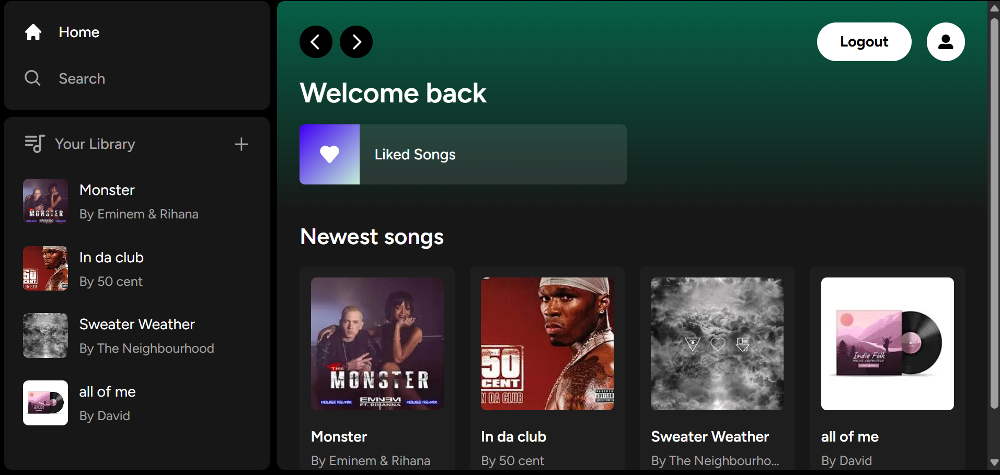
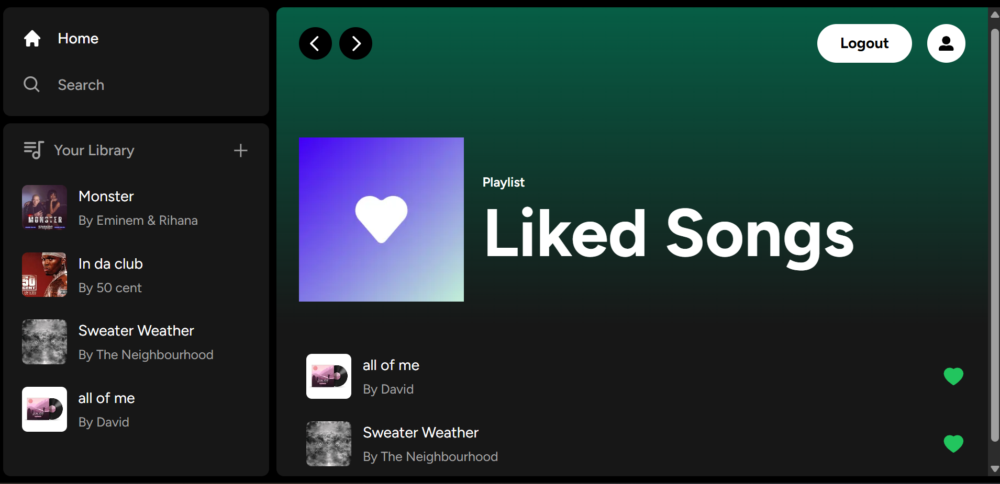
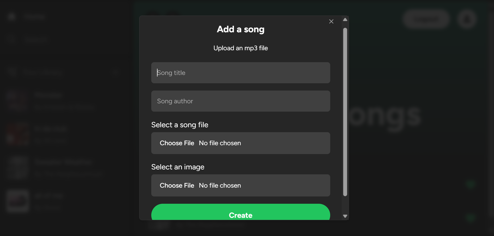
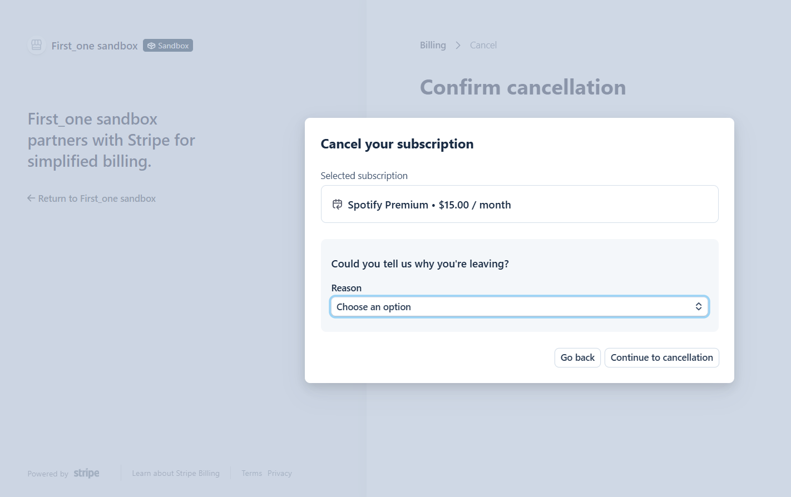
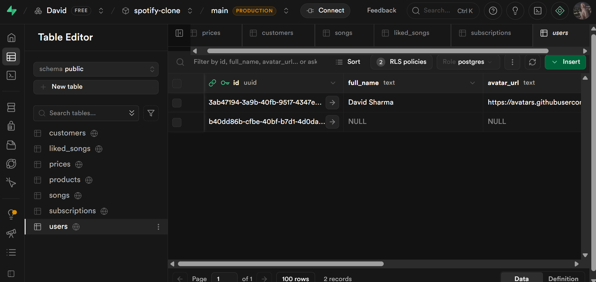

## Getting Started

First, run the development server:

```bash
npm run dev
# or
yarn dev
# or
pnpm dev
# or
bun run dev
```

Open [http://localhost:3000](http://localhost:3000) with your browser to see the result.


### Concepts Involved

* Building RESTful API endpoints with POST, GET, and DELETE route handlers in the App Router (`app/api`)
* Retrieving data directly within Server Components without relying on traditional API requests
* Managing real-time interactions and data flow between Server and Child Components
* Implementing subscription lifecycle management, including Stripe subscription cancellation
* Structuring scalable full-stack applications using Next.js, Supabase, PostgreSQL, and Stripe

### Highlights

* Song upload and playback
* Stripe payments & subscriptions
* Supabase + PostgreSQL integration
* Secure authentication (Credentials & GitHub)
* File and image storage
* Favorites and playlists
* Advanced music player
* Responsive Tailwind UI

### Screenshots

<table>
  <tr>
    <td></td>
    <td></td>
    <td></td>
  </tr>
  <tr>
    <td></td>
    <td></td>
    <td></td>
  </tr>
</table>
